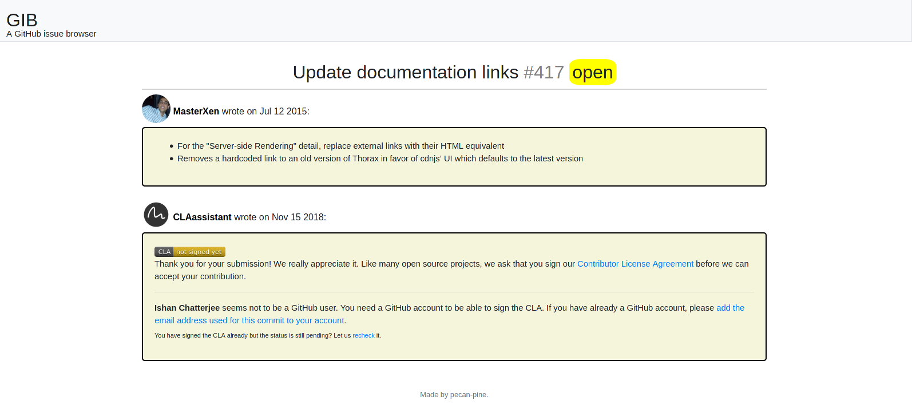

# GIB issue-browser
A **G**itHub **I**ssue **B**rowser app

This app uses a Flask app to make a simple GitHub issue browser. Currently it shows issues from 
https://github.com/walmartlabs/thorax/issues. The app shows a list of issues, with 10 issues per page. 
If you click on an issue name, it shows a detail page with comments about the issues. 

The main page:

A detail page:

